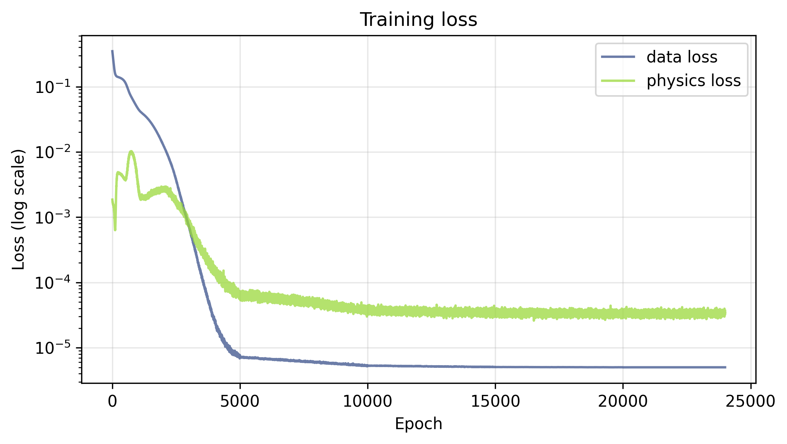
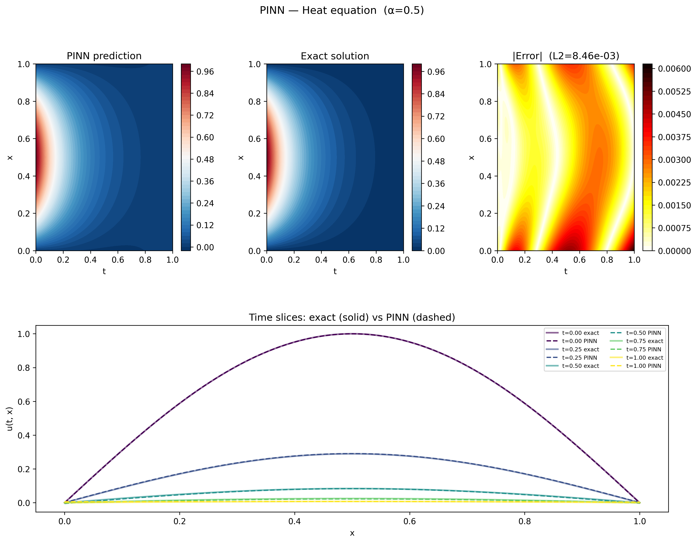
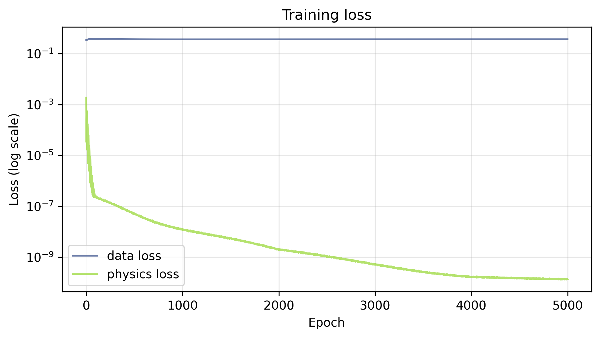
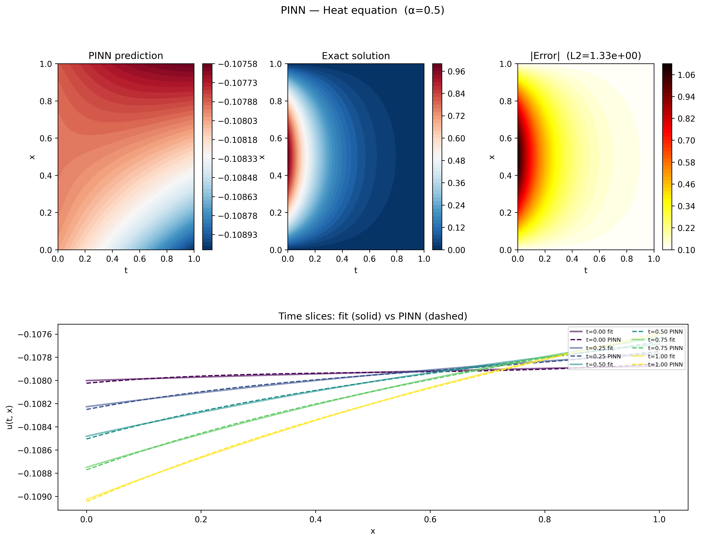
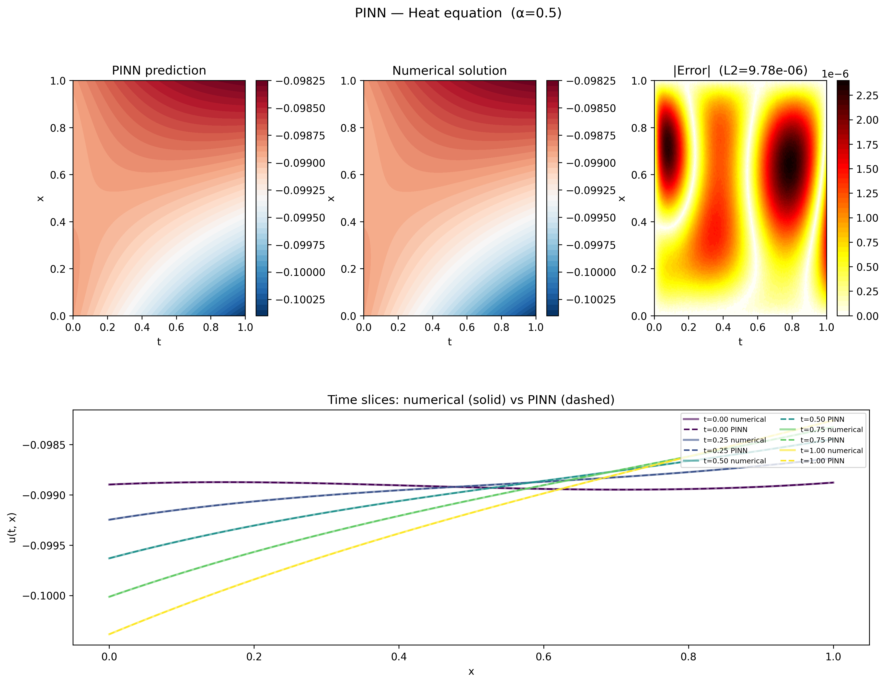
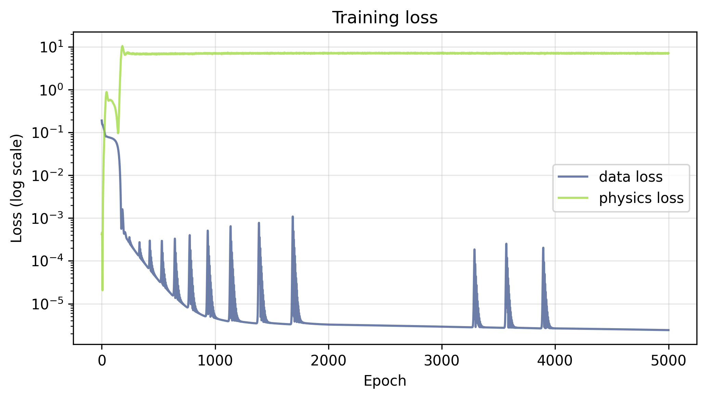
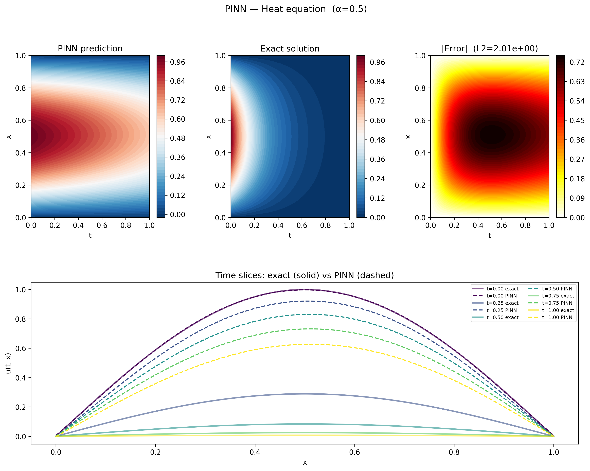

## Introduction
Neural networks have an extraordinary ability to learn highly non-linear
solutions from data. However, the amount of data needed for a neural net to
learn a good, generalizable solution can be vast. Modern LLMs, for example, are
pre-trained on over [15 trillion
tokens](https://huggingface.co/meta-llama/Llama-3.1-8B#training-data). When such
vast datasets are out of reach, there are still options. Architectures can bake
in known structural properties of the problem – convolutional nets exploit
translational invariance, for instance – but this only helps when the constraint
is something that can be encoded in the architecture itself.

Physics-Informed Neural Networks (PINNs) encode known constraints about the 
system being modeled directly into the training objective as an additional 
penalty term. This penalty can be thought of as a form of regularization that 
forces the model to be consistent with properties we know the solution must 
satisfy — whether derived from first principles or empirical knowledge. In the 
context of physics problems, those constraints generally come in the form of 
partial differential equations (PDEs). In these cases, modern ML frameworks like
PyTorch and JAX handle the penalty term quite elegantly due to their
autodifferentiation engines. No need for finite difference approximations or
symbolic math! In this post, I'll focus on PDEs, following the [original
paper](https://arxiv.org/abs/1711.10561), but the same ideas apply anywhere you
have reliable prior knowledge about the system. If you're interested in playing
with the code yourself, you can find the repository
[here](https://github.com/mckuzyk/pinn_heat).

The 1D heat equation makes for a natural first example — it has a clean 
analytical solution we can use to verify our results, and its form is similar 
to the non-linear Burgers' equation used in the original Raissi et al. paper. Beyond just 
showing a working implementation, I'll also explore how each term in the loss
works together to generate a full solution through ablation studies. By the end,
you should have a pretty clear sense of exactly how PINNs work and what
classes of problems you might reach for a PINN to solve.


## The Heat Equation
The 1D heat equation describes how heat diffuses through a medium over time:

$$
\frac{\partial u}{\partial t} = \alpha \frac{\partial^2 u}{\partial x^2}
$$

where $u(x, t)$ is the temperature at position $x$ and time $t$, and $\alpha >
0$ is the thermal diffusivity of the medium.

The analytical solution can be found by assuming the solution separates into a
product of a function of $x$ alone and a function of $t$ alone — an approach
known as separation of variables. This yields a whole class of solutions, some
of which we typically reject because their behavior is non-physical (negative
temperatures, temperatures that go to infinity as time progresses, etc.). We
will focus primarily on the set of solutions having the form

$$
\begin{equation}
\label{eq:general}
u(x, t) = A_0 e^{-Ct}\left[B_0 \sin(\beta x) + B_1 \cos(\beta x)\right]
\end{equation}
$$

with $C > 0$, $\beta = \sqrt{C/\alpha}$ and $A_0$, $B_0$, $B_1$, and $C$ are
free parameters that are determined by the choice boundary and initial
conditions of the physical system.

A full solution to the heat equation can be a sum of any number of functions
having the form of equation \ref{eq:general}, each having the free parameters
set to different values, but we will choose a setup where the exact solution is
a single term. In particular, we consider the problem on the domain $x \in [0,
1]$, $t \in [0, T]$, with the following boundary and initial conditions:

$$
u(0, t) = 0, \quad u(1, t) = 0, \quad u(x, 0) = \sin(\pi x)
$$

The boundary conditions fix the temperature at both ends of the rod to zero for
all time, and the initial condition describes a sinusoidal temperature
distribution along the rod at $t = 0$. Enforcing our boundary and initial
conditions fixes the free parameters uniquely, giving the exact solution:

$$
\begin{equation}
\label{eq:specific}
u(x, t) = e^{-\alpha \pi^2 t} \sin(\pi x)
\end{equation}
$$

The spatial profile remains sinusoidal for all time, decaying exponentially as
heat dissipates.

## The PINN Approach

### Network Architecture
The network itself is a straightforward fully connected MLP that takes the
spatial coordinate $x$ and time $t$ as inputs and outputs the predicted
temperature $\hat{u}(x, t)$:

The default architecture uses 4 hidden layers with 32 neurons each and Tanh
activations throughout. Tanh is a natural choice here — unlike ReLU, it is
infinitely differentiable, which matters because we will need to compute
second-order derivatives of the network output during training.
```python
class PINN(nn.Module):
    def __init__(self, n_neurons, n_layers):
        super().__init__()
        layers = [nn.Linear(2, n_neurons), nn.Tanh()]
        for _ in range(n_layers - 1):
            layers += [nn.Linear(n_neurons, n_neurons), nn.Tanh()]
        layers += [nn.Linear(n_neurons, 1)]
        self.mlp = nn.Sequential(*layers)

    def forward(self, t, x):
        input = torch.cat([t, x], dim=1)
        return self.mlp(input)
```

There is nothing unusual or particularly interesting about this model
architecture. The novelty of the approach is in the loss function, which encodes
the known structure (in this case the heat equation), and the sampling of
_collocation points_, points where we don't know the correct output, but we do
know the governing equation (more on this in the next section).


### Loss Function

The total loss has two components — a data loss and a physics loss:

<div>
\begin{equation}
\mathcal{L} = \lambda_u \mathcal{L}_{data} + \lambda_f \mathcal{L}_{physics}
\label{eq:loss}
\end{equation}
</div>

The weights $\lambda_u$ and $\lambda_f$ control the
relative contribution of each term and are typically each set to 1.0.

The data loss is a standard MSE over the boundary and initial condition points,
locations where we do know the value of $u$:

<div>
\begin{equation}
\mathcal{L}_{data} = \frac{1}{N_u}\sum_{i=1}^{N_u}\left(\hat{u}(t^i, x^i) - u^i\right)^2
\label{eq:loss_data}
\end{equation}
</div>

The physics loss penalizes the network for violating the heat equation at a set
of __collocation points__ — locations in the domain where we don't know $u$, but
we do know the governing equation must hold:

<div>
\begin{equation}
\mathcal{L}_{physics} = \frac{1}{N_f}\sum_{i=1}^{N_f}
\left(
    \frac{\partial \hat{u}}{\partial t}\bigg|_{(t^i, x^i)}
    - \alpha \frac{\partial^2 \hat{u}}{\partial x^2}\bigg|_{(t^i, x^i)}
\right)^2
\label{eq:loss_physics}
\end{equation}
</div>

In other words, $\mathcal{L}_{physics}$ is the mean squared PDE residual — it is
zero only when the network output exactly satisfies the heat equation at every
collocation point. What makes this particularly elegant in PyTorch is that the
derivatives in $\mathcal{L}_{physics}$ are computed via autodifferentiation
directly through the network:
```python
def physics_informed_nn(model, t, x, alpha=ALPHA):
    out = model.forward(t, x)
    u_x = torch.autograd.grad(
        out, x, grad_outputs=torch.ones_like(out), create_graph=True
    )[0]
    u_xx = torch.autograd.grad(
        u_x, x, grad_outputs=torch.ones_like(u_x), create_graph=True
    )[0]
    u_t = torch.autograd.grad(
        out, t, grad_outputs=torch.ones_like(out), create_graph=True
    )[0]

    return u_t - alpha * u_xx
```

`torch.autograd.grad` is less common than a simple `.backward()` call and the
[documentation](https://docs.pytorch.org/docs/stable/generated/torch.autograd.grad.html)
can be a little opaque, so it's worth a closer look. A call
`torch.autograd.grad(output, input, grad_outputs=v)` computes the
vector-Jacobian product $v^T J$, where $J$ is the Jacobian of `output` with
respect to `input`. In our case the network output for a batch of size $n$ is
a tensor of shape `(n, 1)`, so the Jacobian of $\hat{u}$ with respect to
$x$ is a column vector whose $i$-th entry is
$\partial \hat{u}(t^i, x^i) / \partial x^i$. By passing
`grad_outputs=torch.ones_like(out)` we set $v = \mathbf{1}$, which simply
sums the Jacobian entries — giving us the elementwise gradients across the
batch.

The `create_graph=True` argument tells PyTorch to keep the computational graph
alive through the derivative computation so that gradients can be
backpropagated through $\mathcal{L}_{physics}$ during training. Without it,
PyTorch discards the graph after the computation for efficiency, and the second
call to `torch.autograd.grad` for $u_{xx}$ would fail.

### Training Setup

After some experimentation, an Adam optimizer with a StepLR
learning rate scheduler that decays an initial learning rate of 1e-4 by a factor
0.1 every 5000 epochs provided a good balance of performance and speed. The
total number of epochs in the results shared here is 24000. Running on CPU, they
take a minute or two to train.

The boundary and initial condition points are sampled once before training and
held fixed throughout. The collocation points, however, are resampled randomly
every epoch. This means the physics loss is evaluated at a different set of
locations each epoch, which acts as a form of regularization and helps the
network learn to satisfy the heat equation across the full domain rather than
just at a fixed set of points. 

The default sample sizes are:
- $N_u = 200$ data points (100 boundary + 100 initial condition)
- $N_f = 5000$ collocation points

The relatively large number of collocation points compared to data points
reflects the nature of the problem — the physics loss needs to cover the full
two-dimensional domain $(x, t) \in [0,1] \times [0,1]$, while the data loss
only needs to cover the boundary and initial condition. However, the solutions
were still quite good with only 2000 collocation points.

## Results

With $\lambda_u = \lambda_f = 1.0$, there is an early transient in the physics
loss during training, followed by a steady drop in both the physics and data
losses. By the end of training, the data loss is lower than the physics loss,
which could be due to the fact that there are only 200 data points to learn vs.
5000 collocation points, or to the re-sampling of collocation points each epoch
acting as a form of regularization on the physics loss.



With both loss terms active, the PINN recovers the analytical solution well.
The figure below shows the predicted and exact solutions as heatmaps over the
full domain, along with the absolute error. The total L2 error is $8.91 \times
10^{-3}$.



The bottom row shows five time snapshots with the predicted and exact solutions
overlaid. The network captures both the sinusoidal spatial profile and the
exponential decay in time accurately across the full domain, pretty cool!


## Ablation Studies

### Physics Loss Only

Setting $\lambda_u = 0$ removes the boundary and initial condition constraints
from the training objective entirely, leaving the network free to find any
solution that satisfies the heat equation. The loss curves tell the story
clearly — the physics loss drives down below $10^{-9}$ over the course of
training, while the data loss, which is not being optimized, flatlines around
$0.5$ throughout. Interestingly, with no competing data term, the physics loss
reaches a full 5 orders of magnitude smaller than it did when the data loss was
present.



As you might expect from the data loss, the solution learned by the network has
no resemblance to the one we're looking for.



Rather than the decaying sinusoidal profile of the exact solution, the network
has learned something slightly negative across the entire domain, with a roughly
linear solution in $x$ with a slope that increases with time.

To understand what the network actually learned, recall the general solution to
the heat equation can be a sum of many terms belonging to a class of solutions,
and only reduces to the simple form analyzed here with a carefully chosen set of
boundary and initial conditions.

I spent a considerable amount of time trying to pin down the exact analytical
form of this solution, but wasn't able to get a reliable fit to the data. From
the progress I was able to make, it seems that this solution has at least 2
components – the first having the form of equation \ref{eq:general}, but the
second having a general form

$$
\begin{equation}
\label{eq:general_hyper}
u(x, t) = A_0 e^{+Ct}\left(B_0 e^{\beta x} + B_1 e^{-\beta x}\right),
\end{equation}
$$

which is a valid class of solution, but one that is typically discarded due to
the unphysical property that $|u(t,x)| \rightarrow \infty$ as $t \rightarrow
\infty$.

To be sure the solution produced by the PINN is indeed still a solution to the
heat equation (albeit an unphysical solution), we can pick out the initial and
boundary conditions from the PINN solution, and use those in a finite difference
solver to manually integrate the heat equation and see what we get.



As the plots demonstrate, the agreement between the PINN and the numerical
solution is excellent, with an overall L2 of $9.78 \times 10^{-6}$. The time
slices also exhibit the behavior that $|u(t,x)|$ is increasing with time,
consistent with a component of the solution having the form of equation
$\ref{eq:general_hyper}$. The physics loss alone is clearly capable of driving
the network to a valid solution to the heat equation, it simply needs the data
term to select the particular solution we're after

### Data Loss Only

Setting $\lambda_f = 0$ removes the physics constraint entirely, leaving the
network to learn solely from the boundary and initial condition data points.
Unlike the physics only loss, which dropped substantially lower with the data
term gone, here the loss curves show the data loss driving down to around
$10^{-5}$ over the course of training, about the same as it was in the full
solution.  The physics loss, which is not being optimized, shoots up early and
flatlines around $10$ — a reminder that satisfying the boundary conditions alone
says nothing about whether the heat equation is being satisfied in the interior.



The results plot tells a clear story. At $t = 0$ the network matches the exact
solution perfectly — it has direct training data for the initial condition $u(0,
x) = \sin(\pi x)$ and learns it well. But without any physics to guide the
interior, the network fails to learn that the solution should decay
exponentially in time. Instead of the amplitude collapsing toward zero, the PINN
prediction barely decays at all, with an L2 error of $2.20$.



To understand what the network learned in the interior, we can fit the exact
solution form $u(x, t) = a e^{-ct} \sin(\beta x)$ to the PINN output at five
time snapshots:

| Time slice | $a$ | $c$ |
|------------|-----|-----|
| $t = 0.00$ | $1.00$ | $4.94$ |
| $t = 0.25$ | $3.24$ | $4.93$ |
| $t = 0.50$ | $10.44$ | $4.93$ |
| $t = 0.75$ | $33.19$ | $4.93$ |
| $t = 1.00$ | $104.01$ | $4.93$ |

The decay constant $c$ is remarkably consistent across all time slices and
virtually identical to the true value of $\alpha \pi^2 = 0.5 \times \pi^2
\approx 4.93$, confirming that the spatial structure of the solution is correct.
The amplitude $a$, however, grows roughly by a factor of three between each
snapshot — the opposite of the exponential decay we expect. The network has
learned the right shape but the wrong dynamics, compensating for the missing
decay by inflating the amplitude instead. This makes sense – the data provided
to the model includes points on $u(0, x)$, so the model learns the initial
spatial solution, which we know is $\sin (\sqrt{c / \alpha} x)$. Hence, the
adjustable parameter $c$ gets fixed when the model learns to obey the initial
condition. The only remaining degree of freedom is the decay, and the model has
no information to learn how the solution should decay. Without the physics
loss to enforce the heat equation in the interior, there is nothing to prevent
this.

## Summary

PINNs offer an elegant solution to a common problem in scientific machine
learning — what do you do when data is sparse but you know something about
the physics governing the system? By encoding the governing equations directly
into the loss function as a PDE residual, the network is constrained to learn
solutions that are physically consistent, even in regions where no data exists.

The ablation studies make the contribution of each loss term concrete. Without
the data loss, the network finds a valid solution to the heat equation but one
that ignores the boundary and initial conditions entirely — a mathematically
correct but physically meaningless result. Without the physics loss, the network
fits the boundary and initial conditions well but has no reason to obey the heat
equation in the interior, learning the right spatial structure but the wrong
dynamics.

One of the appealing things about PINNs is how little changes when you swap
out the underlying PDE. Extending this to Burgers' equation, or to any other
PDE, requires only updating the physics residual — the network architecture,
training loop, and everything else stays the same. This generality is part of
what makes PINNs a useful tool beyond just physics problems; any system where
you have reliable prior knowledge about the structure of the solution is a
candidate. The low L2 achieved here with only 200 training points and a simple
network demonstrates how powerful the method can be when data is hard to come
by.

An interesting direction not explored here is the inverse problem — rather than
using a known PDE to constrain the solution, you instead learn the parameters
of the PDE itself from data. Raissi et al. explore this in the
[second part](https://arxiv.org/abs/1711.10566) of their original work, perhaps
next time!
