## Introduction
In machine learning, there is a well known tradeoff between model complexity (as
measured by the number of adjustable parameters in the model) and predictive
ability. When a model is overly simplistic, it is unable to learn an accurate
representation of the process under study (high bias). As complexity increases,
so too does performance, but only up to a point. As complexity continues to
increase, the model starts to overfit to the training data, and loses the
ability to generalize to unseen inputs (high variance). Traditionally, the
number of adjustable parameters in a model should be less than the number of
training samples, often by a factor of 5 or 10, to avoid overfitting.

Modern transformers can violate this rule spectacularly, and the consequences
are surprising. In some cases, a transformer with vastly more parameters than
training samples will overfit early in training as expected, but as training
continues will discover a generalizing solution on its own. This is grokking.

In this post, I'll walk through the grokking phenomenon on modular addition. The
transformer used in this work has 226,688 parameters, roughly 750,000x fewer
parameters than GPT-3! The simplified transformer model will allow us to peek
under the hood and see how the model goes from overfitting on a training set
containing only 3,830 samples to perfect generalization. What the model learns
turns out to be surprisingly beautiful – waves propagating through every layer
of the network, combining at the output to form the correct answer.

## Grokking
Grokking was first observed in 2022 by [Power et
al](https://arxiv.org/abs/2201.02177), and the mechanism the transformer learned
in the context of modular addition was reverse engineered by [Nanda et
al](https://arxiv.org/abs/2301.05217). Here, I largely followed the design and
analysis of Nanda et al, and also found [A Mathematical Framework for
Transformer
Circuits](https://transformer-circuits.pub/2021/framework/index.html) to be a
useful resource.

We're training a small transformer to learn modular addition $a + b = c
 \bmod P$ for prime $P$. In this post, $P$ is set to 113. There are $P^2$ input
pairs $(a,b)$, and we pick $30\%$ at random to be the training data. As first
observed by Power et al, when the model is trained, the training loss
immediately drops as the model memorizes the training data, but as training
continues, the test loss suddenly drops with a curve that resembles a phase
transition. After the drop, the model has learned a perfectly generalizable
solution.

The figure below shows the typical loss and accuracy curves observed when
grokking occurs. It was observed by Power et al that grokking tends to happen
when the model weights are small, and Nanda et al showed that weight decay is in
fact necessary – without it, grokking does not occur at all. It is apparent in
the evolution of the weight norm that indeed grokking goes hand in hand with
decaying weights. The gradient norm remains small throughout, suggesting that
despite the apparent abruptness of the transition, the system is evolving
smoothly toward the generalizing solution.

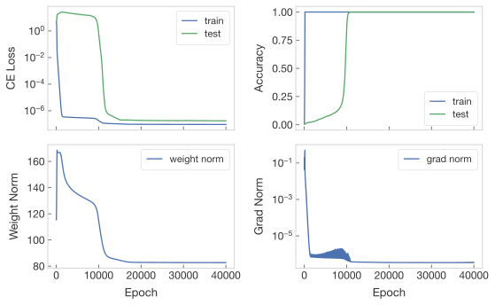
*Training dynamics showing grokking. Train accuracy reaches 100% almost
immediately while test accuracy remains near zero before undergoing a sharp
phase transition around epoch 10,000.*

These results are striking. We have roughly $226,688/3,830 \approx 59$
adjustable model parameters for every training sample, yet the model eventually
finds a perfectly generalizable solution. The natural question is: what exactly
did it learn?

## Implementation
### Overview
Before getting deep in the analysis of what the model is learning, let's review
the transformer architecture, and the design choices used for this
implementation. All of the code used for this post can be found
[here](https://github.com/mckuzyk/grokking).

The transformer is fundamentally a system that learns about sequences. The input
contains a sequence of tokens of length $n_{context}$ which are embedded to form
an input matrix $x_0$ with dimensions $(n_{context}, d_{model})$. $x_0$ is then
fed through one or more blocks, where each block consists of a multi-head
attention layer and a multilayer perceptron (MLP) layer. The output of each
layer in the block is added to the input, forming residual connections. It is
useful to picture the whole network as a residual stream, where each component
of each block successively reads in the current state of the stream, processes
it, and then writes its output back into the stream (see [A Mathematical
Framework for Transformer
Circuits](https://transformer-circuits.pub/2021/framework/index.html)). This
general architecture is depicted in the figure below.

<figure id="schematic" style="text-align: center;">
    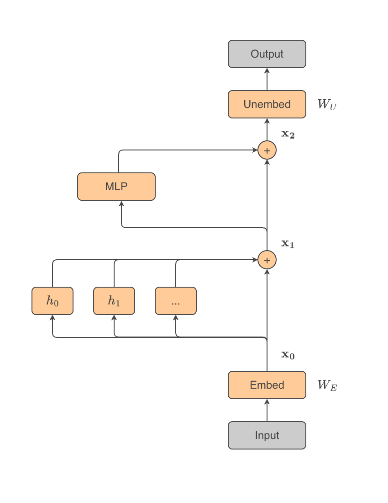
    <figcaption>Schematic of the simplified transformer block structure</figcaption>
</figure>

### Model details
Here, we are keeping only the most essential components of the transformer to
make the model as interpretable as possible. In particular, there is no layer
norm, and no causal mask. Our input is a sequence of three tokens, representing
$a$ and $b$ (the numbers being added), and a special $=$ token where the model
will predict the answer value $c$. The inputs are embedded to $d_{model} = 128$
by a learnable embedding matrix, combined with a learnable positional embedding.
We are using a single block with 4 attention heads, each head using an internal
dimension $d_{head} = 32$. The schematic of a single attention head is depicted
below, labeled with the notation used in this post.

<figure id="schematic_attention" style="text-align: center;">
    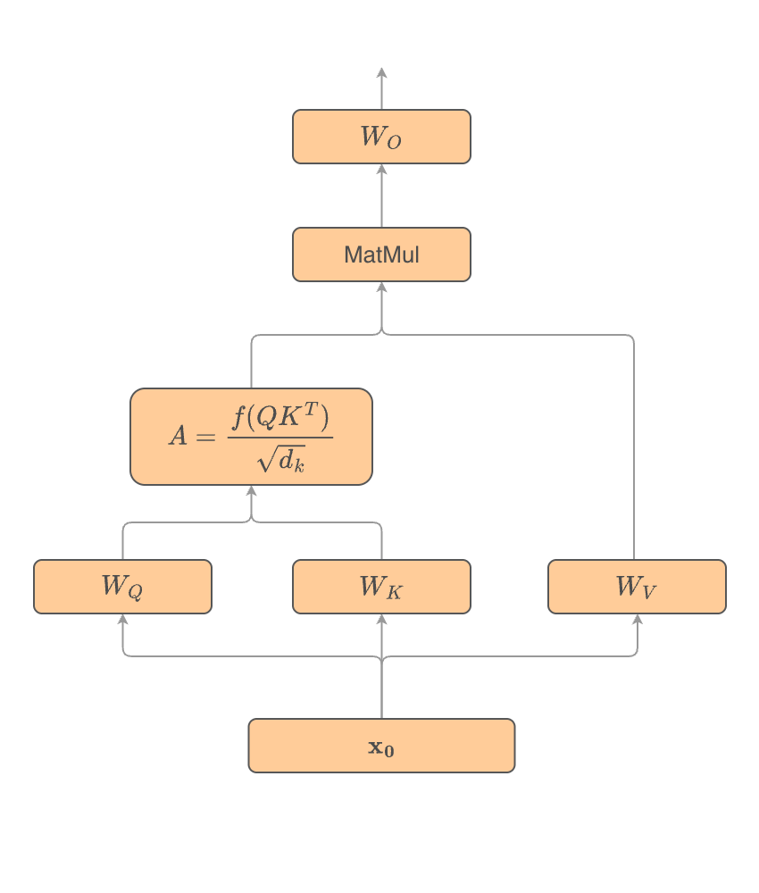
    <figcaption>Schematic of self attention head $h_i$ </figcaption>
</figure>

The input $x_0$ is fed to each head of the attention block, where the $Q$, $K$,
and $V$ matrices are computed by learnable linear projections $W_Q$, $W_K$,
$W_V$ of the input with no biases. In the attention computation $A = f(QK^T) /
\sqrt{d_k}$, the function $f$ is a softmax, and $d_k$ is the dimension of the
key, which here is equal to $d_{head}$. The output is projected by another
linear projection $W_O$.

The MLP has a single hidden layer with dimension $d_{mlp} = 512$ using a ReLU
activation. After the transformer block, an unembed matrix $W_U$ maps to $P=113$
logits.

### Training
Training parameters were set according to Nanda's work, using AdamW with weight
decay $\lambda = 1.0$ and $\beta_2 = 0.98$ (PyTorch defaults are $\lambda =
0.01$ and $\beta_2 = 0.999$). The learning rate is fixed at $1\times 10^{-3}$
with a 10 epoch linear warmup, and training was performed on full batches.

### Getting the details right
Getting the training dynamics right required a few non-obvious choices. Early
runs showed unusual instability – repeated loss spikes long after the initial
grokking transition. This turned out to be [the slingshot
mechanism](https://arxiv.org/abs/2206.04817), a known phenomenon caused by
float32 precision errors in the loss computation. Switching to float64
eliminated the instability, as shown in the top panel of the figure below.

While switching to float64 fixed the slingshot issue, it introduced a new
problem: grokking now took far longer than the ~10,000 epochs reported by Nanda
(some runs took over 100,000 epochs). Inspecting [Nanda's
code](https://github.com/mechanistic-interpretability-grokking/progress-measures-paper)
revealed the culprit: all model weights were initialized from $\mathcal{N}(0,
1/d_{model})$ rather than PyTorch's default Kaiming initialization. Since
grokking requires the weight norm to decay to a small value, starting closer to
that target dramatically reduces training time. With this change, grokking
consistently appeared around 10,000 epochs, as shown in the bottom panel.

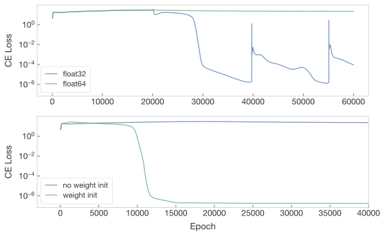
*Implementation details can have a dramatic impact on training. Top: float32
precision errors cause slingshots. Bottom: PyTorch's default weight
initialization leads to very slow emergence of grokking (outside of the training
window pictured).*

With the training dynamics behaving as expected, we can now turn to the more
interesting question: what exactly has the model learned?

## Analysis
The transformer can be divided into four major components: the input embedding,
attention heads, MLP, and output unembedding. Studying each in turn, along with
the evolution of the residual stream, will reveal how the model solves the
generalized modular addition problem.

### Input Embedding
The input embedding is where the transformer builds a semantically meaningful
representation of the input tokens in a high-dimensional space that it can
process through the residual stream. The success of all downstream processing
depends on these embeddings being well-structured for the problem.

The embeddings we're using are relatively small compared to industrial-grade
transformers, but 128 dimensions is still too high-dimensional to inspect
directly. Instead, let's use a simple PCA dimensionality reduction to look at
the structure of the learned embedding space. 

<figure id="embedding_pca" style="text-align: center;">
    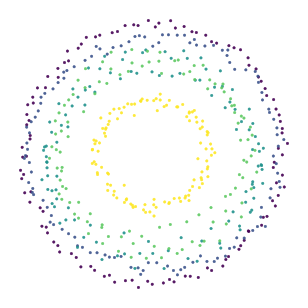
    <figcaption>PCA reveals a highly structured embedding space.</figcaption>
</figure>

The figure above shows the top 5 pairs of principal axes for all 113 input
embeddings. Each color represents a different pair. Clearly there is some
structure to this space. The circles suggest that components of the embeddings
are varying sinusoidally, since a circle can be parameterized as $(x(t), y(t)) =
(\cos(\alpha t), \sin(\alpha t))$. To verify this, let's take a look at the
Fourier transform of the input embedding matrix $W_E$ along the $P$-dimensional
input axis. We average the Fourier power over the $d_{model}$ dimension to
arrive at a single spectrum indicating any periodic structure to the input
embeddings.

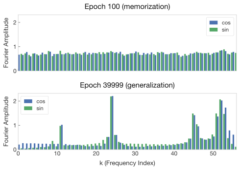
*After grokking, a clear Fourier structure emerges in the embedding space.*

Early in the training, when the model is memorizing the training data, the power
is evenly distributed over all frequencies, but after grokking, a few clear
peaks form. Notice that each peak has nearly equal $\sin$ and $\cos$
contributions, which is why the PCA shows circles instead of ellipses. Together,
the balanced $\sin$ and $\cos$ contributions and the circular PCA structure
indicate that the learned embedding encodes each token $a$ as an angle $2\pi k a
/P$ on a circle, one circle for each frequency component $k$.

It turns out that throughout the network, $\sin$ and $\cos$ amplitudes at each
frequency are balanced, and from here on I will just show the power at each
frequency to reduce clutter in the plots.

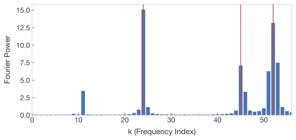
*Fourier power spectrum with the three dominant frequencies identified.*

The plot above shows the Fourier power spectrum, with red lines indicating the
dominant frequencies at indices $k \in \{24, 45, 52\}$. Repeated runs with different
random seeds result in different key frequencies, but in every case the
embeddings learn a small number of dominant frequencies.

### Attention
After an input sequence is embedded, it goes through the attention layer, where
the full residual stream is fed to four separate attention heads, each applying
its own learned projections. Each head independently learns its own rules for
which tokens should attend to which other tokens. To understand what the
attention block is computing, recall that the attention score $A$ is an
$(n_{context}, n_{context})$ matrix, where element $(i, j)$ is a weight
dictating how much information token $i$ draws from token $j$. We are interested
in how the $=$ token is attending to $a$ and $b$, since that is where the answer
goes. With that in mind, let's look at the attention score $A_{2,0}$ for all
input pairs $(a,b)$. We could also look at $A_{2,1}$, but modular addition is
independent of the input ordering, so looking at only $A_{2,0}$ will suffice (I
did confirm the attention patterns of $A_{2,1}$ appear identical).

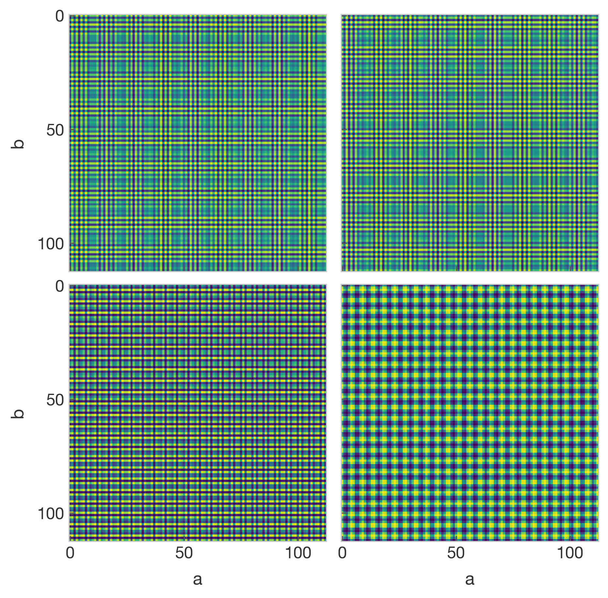
*Learned attention structure from the "=" token to token $a$ from each attention
head across the full set of inputs $(a,b)$.*

The structure is immediately apparent: each head has clear periodic structure.
The top two heads appear visually similar, though ablation tests showed that
removing either one significantly degrades accuracy. The bottom two heads are
distinctly different from each other and from the top pair.

So, the embeddings are periodic with a few key frequencies, and the attention
heads are clearly periodic too. Do they use the same frequency components as the
embeddings?

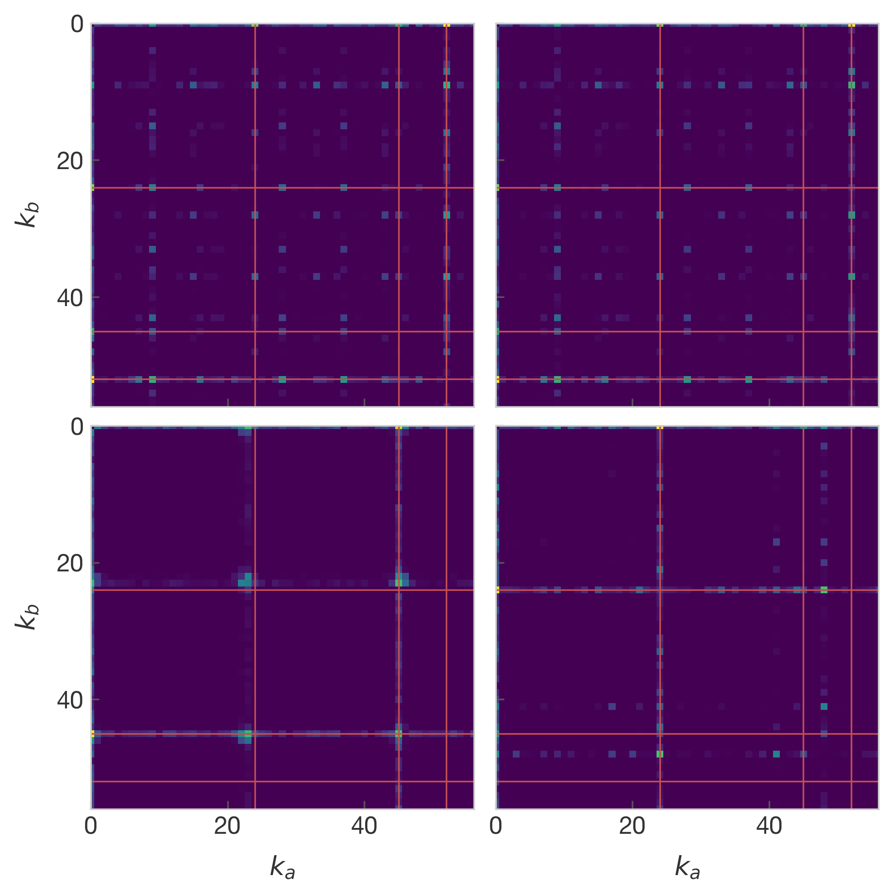
*2D Fourier transform of attention heads show the periodic structure. Red
guidelines indicate the key frequencies from the embedding space.*

A 2D Fourier transform shows that the major frequency components of the
attention heads are indeed the same frequencies used by the embeddings, which
are indicated by red lines on the figure. The largest contributions by far on
all four plots happen right on the edge and exactly in line with the embedding
frequencies. They appear as bright yellow spots along the top and left edges of
the plots. Because those contributions were so large, these plots are showing
the $\log$ of the power spectra so that other frequencies are visible. 

Notably, the bottom left panel appears to be the only attention head where the
frequencies aren't separable. When testing other random seeds, I found that
there isn't always a non-separable head like this.

In every test, the attention heads operate at the same frequencies established
in the embedding space, though the specific patterns vary. Let's follow that
signal through the rest of the network.

### The Signal Chain
At this point it seems likely that the Fourier structure established in the
embeddings and preserved through the attention block is core to the general
solution the transformer learned. To drive this point home, let's track
the Fourier spectrum at four points as information flows through the network,
indicated on the block diagram above: $W_E$, the residual stream after the
attention block $x_1$, the residual stream after the MLP $x_2$, and finally the
output.

For the output stage, rather than examining $W_U$ directly, we look at the
combined matrix $W_L = W_UW_{out}$, where $W_{out}$ is the output projection of
the MLP. This is motivated by an observation from Nanda et al: empirically, the
skip connection around the MLP contributes very little to the output, so the
logits are well approximated by $W_UW_{out}\cdot \mathrm{MLP}(a,b)$. The matrix
$W_L$ therefore directly maps MLP activations to output logits, making it the
natural object to analyze at the output stage.

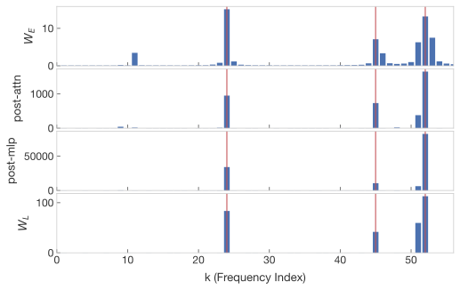
*Evolution of the Fourier power spectrum at key points in the network. From top
to bottom: embedding $W_E$, residual stream post attention $x_1$, residual
stream post MLP $x_2$, and output $W_L$.*

The evolution makes it clear that the same Fourier structure is preserved
throughout the network. There is also a clear selective amplification and
filtering. Between the input and output matrices, there's a roughly 10x
amplification, while the broad peaks in $W_E$ sharpen to near-single-frequency
spikes in $W_L$. In the residual stream, there's an even more dramatic 50x
amplification. At every point, the relative amplitudes of the key frequencies
appear to vary, suggesting the network is doing something more sophisticated
than uniform amplification. The filtering and amplification of key frequencies
is apparent in the fraction of total power contained in the key frequencies,
summarized in the table below.

| Stage | Key Frequency Power Fraction |
|-------|------------------------------|
| $W_E$ | 0.52 |
| $x_1$ | 0.87 |
| $x_2$ | 0.94 |
| $W_L$ | 0.79 |

Between the $W_E$ and $W_L$, the network learns increasingly sparse Fourier
representations, while the residual stream shows the MLP further concentrating
power in the key frequencies.

## The Full Picture
So what is the network actually doing with this Fourier structure? First of all,
in hindsight a Fourier basis is a natural choice for solving modular addition –
both the basis and the solution we seek are periodic with period $P$. For a
detailed analysis of the mechanisms, take a look at [Nanda et
al](https://arxiv.org/abs/2301.05217). Here's the layout of what's happening.

### The Algorithm
First, as discussed above, the token $a$ (and similarly $b$) is encoded as
$\sin$ and $\cos$ of a number of angles $\omega_k a \equiv 2\pi k a /P$ for the
key frequencies $\omega_k$. In the attention heads, the bilinear $QK^T$
interaction computes products of Fourier components
$\cos(\omega_ka)\cos(\omega_kb)$ and $\sin(\omega_ka)\sin(\omega_kb)$. The MLP
then computes the angle sums from the products according to the trigonometric
identities

$$
\begin{eqnarray}
\cos(\omega_k(a+b)) &=& \cos(\omega_ka)\cos(\omega_kb) -
\sin(\omega_ka)\sin(\omega_kb) \nonumber \\
\sin(\omega_k(a+b)) &=& \sin(\omega_ka)\cos(\omega_kb) +
\cos(\omega_ka)\sin(\omega_kb) \nonumber 
\end{eqnarray}
$$

The output matrix $W_L$ makes further use of trigonometric identities to compute

$$
\begin{equation}
\label{eq:logit}
\cos(\omega_k(a+b-c)) = \cos(\omega_k(a+b))\cos(\omega_kc) +
\sin(\omega_k(a+b))\sin(\omega_kc)
\end{equation}
$$

for output logit $c$, and sums over the key frequency indices $k$.

The last step deserves some attention. Why does summing these $\cos$ terms give
the correct answer logit $c^*$ a higher score than the other $c$'s? The answer
is interference. $\cos(\theta)$ is maximized when $\theta=2\pi n$ for integer
$n$. A given logit meets this condition when $a + b - c = m P$ for any integer
$m$. For the correct logit $c^* = a + b \bmod P$, this condition is met for all
$k$, and the contributions add up. At all other logit positions, the $\cos$
terms for different $k$ are equally likely to be positive or negative, so their
contributions cancel and the sum tends to zero. This scenario of waves building
additively in one region and canceling each other out in other regions is a form
of interference.

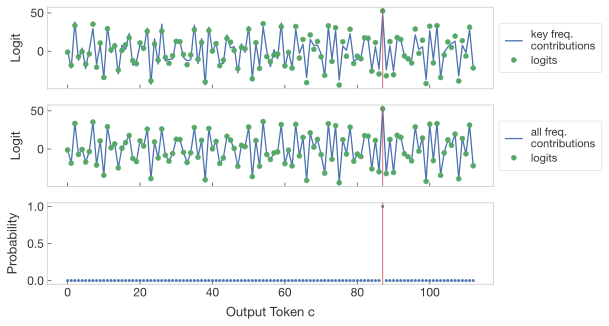
*Comparing output logits to $\cos$ contributions for $a=50$, $b=37$, with red
line on answer token. Top: output logits using only the 3 key frequencies gives
almost the exact logit scores. Middle: summing all $\cos$ contributions gives an
exact match to the logits. Bottom: Converting contributions from key frequencies
to probability.*

The figure above shows how this manifests when the transformer adds the numbers
50 and 37. In the top panel, I'm directly estimating the logits using equation
\ref{eq:logit} for the key frequencies having $k \in \{24,45,52\}$. The
contributions from just those frequencies, out of 113 total frequencies, give
almost perfect overlap with the logits computed by the transformer. The middle
panel adds all 113 frequencies, and has perfect agreement with the logits. It's
worth stressing again that the blue lines are computed independently of what the
network is doing. The only information we're using is that the network appears
to be operating on the 3 key frequencies we identified. And yet, we can fully
reproduce all of the raw logit scores, indicating that our Fourier model matches
the mechanics actually operating in the transformer. While the score of the
correct logit doesn't look much above the noise, the softmax function
exponentiates the logits before normalizing, so even modest differences in raw
scores translate to dramatically different probabilities. As the bottom panel
shows, the model is actually extremely confident in the correct answer.

## Closing Thoughts
It's fascinating how much structure a small transformer encodes when solving
even a simple problem. Rather than memorizing 3,830 input-output pairs, the
model discovered a compact mathematical algorithm that exploits the periodicity
of modular arithmetic through a sparse Fourier representation that threads
through every layer of the network, culminating in an interference of waves at
the output that naturally produces the correct answer.

This mechanism — waves of the same frequency combining constructively at one
point and destructively everywhere else — has a striking parallel in quantum
computing. Quantum algorithms like Shor's algorithm for integer factorization
rely on the quantum Fourier transform to encode information as quantum
amplitudes, then orchestrate interference so that the correct answer is
amplified while wrong answers cancel. The transformer has independently arrived
at the same computational motif: encode the problem in a Fourier basis, use the
periodicity of the problem to align phases at the correct answer, and let
interference do the rest. It makes me wonder what undiscovered mechanisms could
be hidden in more complex models.
