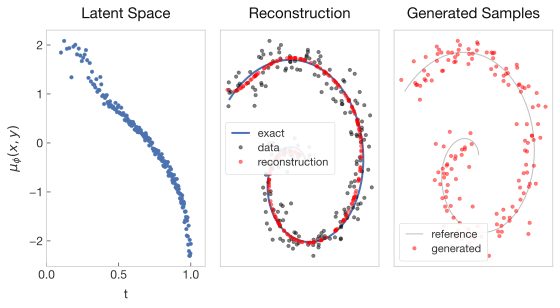
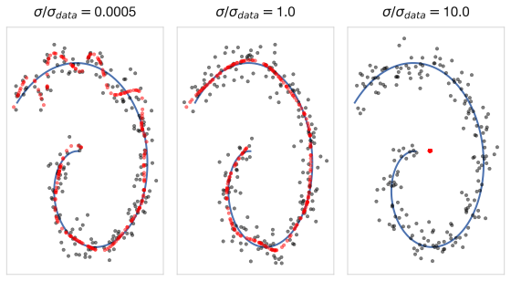
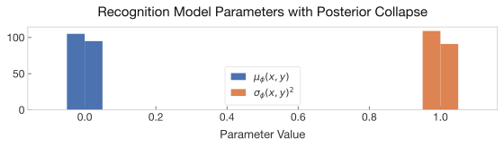

## Introduction
In machine learning, there are broadly two classes of models: discriminative,
and generative. Discriminative models take data (observations), and produce
predictions. Generative models work by learning the distribution that produced
the data, and using it to generate new samples. To be more precise, given
observations $x$ and predictions $y$, a discriminative model seeks to learn
$p(y|x)$, while a generative model seeks to learn $p(x)$.

In this post I'll explore one type of generative model, the variational
autoencoder (VAE), first introduced by [Kingma and
Welling](https://arxiv.org/abs/1312.6114). VAEs are particularly suited to
problems where the observed data is believed to be generated by an underlying
set of unobserved latent variables — structure that is real but not directly
measurable. The VAE addresses this by learning two things jointly: an encoder
that maps observations to a distribution over latent variables, and a decoder
that maps latent variables back to the data space. Together these give us both a
generative model and a structured latent representation of the data.

To build intuition for the loss function and training procedure, we'll apply a
VAE to a synthetic dataset generated by a known process — points on a 2D spiral
with additive noise. Having access to the true underlying process lets us verify
that the model is learning something meaningful, and explore how architectural
choices affect the result. The code used for this post can be found
[here](https://github.com/mckuzyk/vae_demo).


## Variational Autoencoders
Let's start by breaking down what the name implies about VAEs. They are
"variational" because they seek to solve a variational Bayes problem – to learn
approximate representations of the posterior probability $p(z|x)$ for some
latent variables $z$, and to learn a lower bound on the evidence (aka marginal
likelihood) $p(x)$ over observations $x$. They are "autoencoders" because they
have the classic encoder-decoder structure. However, unlike a traditional
autoencoder that maps each observation $x$ to a single point $z$ in latent
space, a VAE maps each observation to a distribution $q_\phi(z|x)$ over latent
variables.

There are some assumptions about the process being modeled that are important to
keep in mind. The dataset $X = \{ x^{(i)}\}_{i=1}^{N}$ is assumed to
consist of $N$ i.i.d samples of a discrete or continuous variable $x$. The
latent variables $z$ are assumed to be continuous.

We can think of the underlying process as consisting of 2 steps:

1. A latent variable $z^{(i)}$ is sampled from a prior distribution
   $p_{\theta^*}(z)$.
2. A value $x^{(i)}$ is produced by sampling the conditional distribution
   $p_{\theta^*}(x|z)$.

The prior $p_{\theta^*}(z)$ and likelihood $p_{\theta^*}(x|z)$ are assumed to
belong to parametric families of distributions $p_{\theta}(z)$ and
$p_{\theta}(x|z)$, and the hope is that the paramaters $\theta$ that will be
learned during training will be a good approximation to the true values
$\theta^*$.

More formally, we will have an encoder $q_\phi(z|x)$, also referred to as the
recognition model. Given an observation $x$, we can sample from $q_\phi$ to
generate a latent representation $z$. The decoder, $p_\theta(x|z)$ takes a
latent representation $z$, and produces new observations $x$.


### The Variational Lower Bound (ELBO)
Remember that the goal of variational Bayes is to learn $p(x)$ by maximizing the
marginal likelihood over observations. Because the VAE framework assumes
datapoints are i.i.d, the log marginal likelihood over the data is $\log
p_\theta(x^{(1)},...,x^{(N)}) = \sum_{i=1}^N \log p_\theta(x^{(i)})$. To relate
the encoder to the likelihood, there are a number of approaches. I like this
approach following Kingma and Welling's [longer
introduction to VAEs](https://arxiv.org/abs/1906.02691):
$$
\begin{eqnarray}
\log p_\theta(x) &=& \mathbb{E}_{q_\phi(z|x)}[\log p_\theta(x)] \nonumber \\ 
&=& \mathbb{E}_{q_\phi(z|x)}\left[\log\left[\frac{p_\theta(x,z)}{p_\theta(z|x)}\right]\right] \nonumber \\
&=& \mathbb{E}_{q_\phi(z|x)}\left[\log\left[\frac{p_\theta(x,z)}{q_\phi(z|x)}\frac{q_\phi(z|x)}{p_\theta(z|x)}\right]\right] \nonumber \\
&=& \mathbb{E}_{q_\phi(z|x)}\left[\log\left[\frac{q_\phi(z|x)}{p_\theta(z|x)}\right]\right]+ 
\mathbb{E}_{q_\phi(z|x)}\left[\log\left[\frac{p_\theta(x,z)}{q_\phi(z|x)}\right]\right]  \nonumber \\
&=& D_{KL}(q_\phi(z|x)||p_\theta(z|x)) + \mathcal{L}(\theta, \phi; x)
\end{eqnarray}
$$
The term $D_{KL}(q_\phi(z|x)||p_\theta(z|x))$ is the Kullback-Leibler (KL)
divergence – a function that is strictly non-negative, and equals zero only when
the $q_\phi(z|x) = p_\theta(z|x)$. The second term is called the *variational
lower bound*, or *evidence lower bound* (ELBO), since the non-negativity of
$D_{KL}$ ensures that
$$
\begin{eqnarray}
\mathcal{L}(\theta, \phi; x) &=& \log p_\theta(x) - D_{KL}(q_\phi(z|x)||p_\theta(z|x)) \\
&\le& \log p_\theta(x)
\end{eqnarray}
$$

The form we have written $\mathcal{L}$ makes it clear that it is a lower bound
on our quantity of interest $p_\theta(x)$, and that maximizing $\mathcal{L}$
will tend to pull $q_\phi(z|x)$ towards $p_\theta(z|x)$. However, the current
form doesn't help us actually maximize the ELBO, since it depends on the
intractable true posterior $p_\theta(z|x)$. Let's see if we can eliminate that
dependence:
$$
\begin{eqnarray}
\mathcal{L}(\theta, \phi; x) &=& \log p_\theta(x) - D_{KL}(q_\phi(z|x)||p_\theta(z|x))  \nonumber \\
&=& \log p_\theta(x) -
\mathbb{E}_{q_\phi(z|x)}\left[\log q_\phi(z|x) - \log p_\theta(z|x)   \right] \nonumber \\
&=& \mathbb{E}_{q_\phi(z|x)}\left[\log p_\theta(x) - \log q_\phi(z|x) + \log p_\theta(z|x)   \right] \nonumber \\
&=& \mathbb{E}_{q_\phi(z|x)}\left[-\log q_\phi(z|x) + \log p_\theta(z,x) \right] \nonumber \\
&=& \mathbb{E}_{q_\phi(z|x)}\left[-\log q_\phi(z|x) + \log p_\theta(x|z) + \log
p_\theta(z) \right] \nonumber \\
\label{eq:ELBO}
&=& -D_{KL}(q_\phi(z|x)||p_\theta(z)) + \mathbb{E}_{q_\phi(z|x)}\left[
\log p_\theta(x|z) \right]
\end{eqnarray}
$$

We now have almost everything we need to optimize our system. The ELBO is
composed of two terms. The first term depends on the encoder $q_\phi(z|x)$, and
the second term depends on the decoder $p_\theta(x|z)$. We would like to
parameterize the encoder and decoder using neural networks and optimize $\theta$
and $\phi$ via gradient descent. However, there is one problem remaining.


### A Roadblock for Optimization
To really understand the problem, let's take a step back and think about what
we've accomplished so far, and what an implementation of VAE training might look
like. Recall that we are assuming $q_\phi(z|x)$, $p_\theta(z)$, and
$p_\theta(x|z)$ all belong to families of distributions that can be
parameterized. Let's be more explicit now, and assume 
$$
\begin{equation}
\label{eq:encoder_model}
q_\phi(z|x) \sim
\mathcal{N}\left(\mu_\phi(x), \sigma^2_\phi(x) \right)
\end{equation}
$$
$$
\begin{equation}
\label{eq:decoder_model}
p_\theta(x|z) \sim
\mathcal{N}\left(\mu_\theta(z), \sigma^2_\theta(z) \right)
\end{equation}
$$
$$
\begin{equation}
p_\theta(z) \sim
\mathcal{N}\left(0, I \right)
\end{equation}
$$
We are going to learn $\mu_\phi(x)$ and $\sigma_\phi(x)$ through a neural network
(the encoder), and $\mu_\theta(z)$ and $\sigma_\theta(z)$ through another neural
network (the decoder). The loss will be composed of 2 terms, according to
equation \ref{eq:ELBO}.

The first term, given the choice of normal distribution
families, can be expressed analytically as
$$
\begin{equation}
\label{eq:dkl_exact}
D_{KL}(\mathcal{N}\left(\mu_\phi(x), \sigma_\phi(x) \right)||\mathcal{N}\left(0, I \right)) = -\frac{1}{2}
\sum_{j=1}^J\left(
1 + \log\left((\sigma_\phi(x)_j)^2\right) - (\mu_\phi(x)_j)^2 -
(\sigma_\phi(x)_j)^2
\right)
\end{equation}
$$
where $J$ is the dimension of $z$, and $\sigma_\phi(x)_j$ is the $j^{th}$
component of $\sigma_\phi(x)$ (and similarly for $\mu$). This term is perfect,
we have an analytical form for the loss and can easily use gradient descent to
optimize $\phi$.

The second term, commonly referred to as the reconstruction loss, is now
$$
\begin{equation}
\label{eq:reconstruction_exact}
\mathbb{E}_{q_\phi(z|x)}\left[\log\left( \mathcal{N}\left(\mu_\theta(z), \sigma_\theta(z) \right)\right) \right] \approx 
\frac{1}{L}\sum_{l=1}^L \log \left( \mathcal{N}\left(\mu_\theta(z^{(l)}), \sigma_\theta(z^{(l)}) \right) \right)
\end{equation}
$$
where the sum is over $L$ instances of $z$ sampled from
$\mathcal{N}\left(\mu_\phi(x), \sigma_\phi(x) \right)$. This term is
problematic, because sampling is a non-differentiable operation that we cannot
backpropagate through. And that brings us to the reparameterization trick.


### The Reparameterization Trick
To optimize the ELBO we need to backpropagate gradients through both terms with
respect to $\phi$ and $\theta$. The first term (KL divergence) is
straightforward to differentiate, as discussed previously, but the second term
(reconstruction loss) is problematic. Estimating it requires sampling $z \sim
q_\phi(z|x)$, and sampling is a non-differentiable operation: there is no
well-defined gradient of a sample with respect to the distribution's parameters
$\phi$. Gradients can't flow backward through a stochastic node, which means we
cannot directly optimize $\phi$ in the reconstruction term.

The reparameterization trick resolves this by restructuring where in the network
the stochasticity lives. Rather than sampling $z$ directly from $q_\phi(z|x)$,
we introduce an auxilliary random variable $\epsilon \sim p(\epsilon)$ that is
independent of $\phi$, and express $z$ as a deterministic function of
$\epsilon$ and $x$:

$$
\begin{equation}
z = g_\phi(\epsilon, x)
\end{equation}
$$

It then follows from the change of variables theorem that

$$
\begin{equation}
\mathbb{E}_{q_\phi(z|x)}[f(z)] = \mathbb{E}_{p(\epsilon)}[f(g_\phi(\epsilon,x))]
\end{equation}
$$

The two epxectations are equivalent, but the right-hand side has the crucial
property that $\phi$ only enters through the deterministic, differentiable
function $g_\phi$, while the randomness is isolated in $\epsilon$. Gradients can
now flow through $g_\phi$ using standard backpropagation.

For the Gaussian case we've been discussing, where $q_\phi(z|x) \sim
\mathcal{N}(\mu_\phi(x), \sigma_\phi(x))$, the reparameterization takes a
particularly simple form:

$$
\begin{equation}
z = \mu_\phi(x) + \sigma_\phi(x) \cdot \epsilon, \quad   \epsilon \sim \mathcal{N}(0,I)
\end{equation}
$$

The encoder network outputs $\mu_\phi(x)$ and $\sigma_\phi(x)$, and $z$ is
computed from them via this deterministic expression. The stochastic node has
been replaced by a deterministic one, with the randomness pushed to an input
$\epsilon$ that requires no gradient. The full model is now end-to-end
differentiable.


## The Data
We're going to work through building and training a VAE on a 2D spiral dataset
with additive noise. The 2D spiral is a great test case because it's just
complex enough to be non-trivial to train a model on, but simple enough that we
can develop a complete Bayesian model of the process. It's also a breeze to
visualize.

The easiest way to think about generating a spiral is to use polar coordinates.
To generate a spiral, increase the polar angle $\theta$ linearly in time with
rate $\omega$, and increase the radius $r$ linearly at rate $\dot{r}$. So, in
polar coordinates, the spiral is parameterized by a single value $t$ according
to $(r(t), \theta(t)) = (\dot{r}t,\omega t)$. Using basic trigonometry , we can
re-write the equations in terms of the Cartesian coordinates $(x,y)$. Adding
isotropic Gaussian noise, we arrive at the spiral random variables we wish to
study:
$$
\begin{eqnarray}
\label{eq:xt}
x(t) &=& \dot{r}t\cos(\omega t) + \epsilon_x  \\
\label{eq:yt}
y(t) &=& \dot{r}t\sin(\omega t) + \epsilon_y  \\
\end{eqnarray}
$$
where $\epsilon_x,\epsilon_x \sim \mathcal{N}(0,\sigma_{data}^2)$. The parameter $t$
serves as the latent variable $z$, and I'll use $z$ and $t$ interchangeably.
We'll generate our data for values $t \in [0,1]$.

Let's think about the Bayesian model for this
process. The process fits naturally into the two-step generative framework
introduced earlier:
1. A latent variable $t$ is sampled (let's say from the uniform distribution).
2. A value $(x, y)$ is produced by sampling from a conditional distribution
   $p_\theta(x,y|z)$.

The distribution $p_\theta(x,y|z)$ also deserves some more attention. Without
the latent variable, $x$ and $y$ are dependent variables (just think about the
distribution of $y$ for a fixed $x$ where the spiral crosses vs. an $x$ far from
a crossing). However, once the latent variable $t$ has been specified, $x(t)$
and $y(t)$ are independent random variables since $\epsilon_x$ and $\epsilon_y$
are independent. That means $x$ and $y$ are independent conditioned on $t$, so
$p_\theta(x,y|z) = p_\theta(x|z) p_\theta(y|z)$. Then using equations
\ref{eq:xt}, \ref{eq:yt},

$$
\begin{equation}
p_\theta(x,y|z=t) = \mathcal{N}(\dot{r}t\cos(\omega t), \sigma_{data}^2)
\cdot \mathcal{N}(\dot{r}t\sin(\omega t), \sigma_{data}^2)
\end{equation}
$$
In other words, the variance in our generative model $p_\theta(x,y|z)$ is a
constant, equal to $\sigma^2_{data}$. This property of our data model – that the
observation noise is constant and known – will directly inform our choice of
decoder, which we discuss in the next section.


## Implementation
With the basic mechanisms of VAEs squared away, and a dataset specified, it's
finally time to implement a VAE. All of the code is available
[here](https://github.com/mckuzyk/vae_demo).

### Model
#### Encoder
We are modeling the encoder as being a member of a Gaussian distribution with
mean and variance that depend on the input $x$ (equation
\ref{eq:encoder_model}). We can implement the encoder as a simple MLP.

```python
class SpiralEncoder(nn.Module):
    """
    Encode 2D spiral data points encoded according to recognition model
    q_phi(z|x). q_phi(z|x) is assumed normal, and the encoder predicts
    the mean and log variance per data point x.
    """

    def __init__(self, latent_dims=1, hidden_dim=32, hidden_layers=1):
        super().__init__()
        self.latent_dims = latent_dims
        self.hidden_dim = hidden_dim
        self.hidden_layers = hidden_layers
        layers = [nn.Linear(2, hidden_dim), nn.Tanh()]
        for _ in range(hidden_layers - 1):
            layers += [nn.Linear(hidden_dim, hidden_dim), nn.Tanh()]
        self.h = nn.Sequential(*layers)
        self.linear_mu = nn.Linear(self.hidden_dim, self.latent_dims)
        # mlp_sigma predicts the log variance, not the variance or std
        self.linear_sigma = nn.Linear(self.hidden_dim, self.latent_dims)

    def forward(self, x):
        h = self.h(x)
        mu = self.linear_mu(h)
        sigma = self.linear_sigma(h)
        return mu, sigma
```
The encoder takes in a data point $\mathbf{x} = (x,y)$, and produces two outputs,
$\mu_\phi(\mathbf{x})$, $\log\sigma^2_\phi(\mathbf{x})$. The model is assumed to
output log variance for numerical stability. The default `latent_dims=1`
reflects our data model, where a single parameter $t$ generates each
observation. The `hidden_dim=32` and `hidden_layers=1` works for simple spiral
data, though in some of my tests I've bumped them up to 64 and 2 respectively.

#### Reparameterization Trick
The encoder gives us the predictions for $\mu_\phi(\mathbf{x})$,
$\log\sigma^2_\phi(\mathbf{x})$. Next, we need to generate a sample latent
variable from $\mathcal{N}(\mu_\phi(\mathbf{x}), \sigma^2_\phi(\mathbf{x}))$.
Remember, this is where the reparameterization trick is needed, so that
gradients can flow back through the encoder.

```python
def reparam(mu, logsigma):
    """
    Reparamaterization trick to backprop through sampling q_phi(z|x).
    mu, logsigma are the outputs of the encoder. logsigma is treated
    as being log (sigma^2).
    """
    samples = torch.randn_like(logsigma)
    sigma = torch.exp(0.5 * logsigma)
    return mu + sigma * samples
```
The randomness is isolated in `torch.randn_like(logsigma)`, which has no
dependence on $\phi$, while $\phi$ enters through `mu` and `logsigma` via
oridinary differentiable operations.

#### Decoder
The decoder is being modeled as a Gaussian distribution, just like the encoder,
according to equation \ref{eq:decoder_model}. But based on the system we're
modeling, there's an important design consideration to address in the decoder.
Recall that for our spiral data, we found that the variance for the generative
model $p_\theta(x,y|z)$ was constant, with a value $\sigma^2_{data}$. Since we
know the variance is constant, we'll leave it out of the decoder MLP, and
instead opt to set it manually as a parameter of the reconstruction loss. With
this simplification in mind, here is an implementation of the decoder:

```python
class SpiralDecoder(nn.Module):
    """
    Decode 2D spiral data points from latent variable z according to a
    generative model p_theta(x|z). p_theta(x|z) is assumed to be normal
    with mu per latent instance z and variance fixed. In other words, the
    model simply outputs mu_theta(z) due to our assumptions.
    """

    def __init__(self, latent_dims=1, hidden_dim=32, hidden_layers=1):
        super().__init__()
        self.latent_dims = latent_dims
        self.hidden_dim = hidden_dim
        self.hidden_layers = hidden_layers
        layers = [nn.Linear(self.latent_dims, hidden_dim), nn.Tanh()]
        for _ in range(hidden_layers - 1):
            layers += [nn.Linear(hidden_dim, hidden_dim), nn.Tanh()]
        layers += [nn.Linear(hidden_dim, 2)]
        self.mlp = nn.Sequential(*layers)

    def forward(self, z):
        return self.mlp(z)
```
The variable `latent_dims=1` is set independently on the decoder, but it must
match whatever value is used in the encoder. The output dimension is hard-coded
to 2 since we are reconstructing 2D points.

### Loss
The KL loss term can be written out analytically according to equation
\ref{eq:dkl_exact}, where we have assumed the prior of over $z$ is a standard
normal. The reconstruction loss is worth a closer look now that we have
solidified our assumptions about the data.

```python
def KL_loss(mu, logsigma):
    """
    mu: encoder predicted mu_phi(z|x)
    logsigma: encoder predicted log(sigma_phi(z|x)^2)
    """
    sigma_squared = logsigma.exp()
    per_dim = 0.5 * (1 + logsigma - mu**2 - sigma_squared)
    per_datapoint = per_dim.sum(dim=1)
    return -per_datapoint.mean()
```

Notice the implementation differs by a minus sign from the corresponding term in
the ELBO. This is because the ELBO is a lower bound, but in normal gradient
descent we are attempting to minimize the loss function. The same sign change
appears in the reconstruction term.

Recall the functional form of the reconstruction loss follows equation
\ref{eq:reconstruction_exact}. The expectation value is estimated by a sample
mean over $L$ points, and is the log of a normal distribution with parameters
$\mu_\theta(z^{(l)})$, $\sigma_\theta(z^{(l)})$. We will follow the common
practice of setting $L = 1$ and use the single latent variable sampled by the
encoder. The term $\sigma_\theta(z)$ needs to be considered carefully.

As discussed in the previous section, our data generation model has a fixed
variance $\sigma^2_{data}$, so having the decoder learn $\sigma_\theta(z)$ would
add unnecessary complexity. Assuming a fixed $\sigma_\theta(z) = \sigma$, the
reconstruction loss can now be expressed explicitly as

$$
\begin{eqnarray}
\frac{1}{L}\sum_{l=1}^L \log\left(
\mathcal{N}\left(\mu_\theta(z^{(l)}), \sigma_\theta(z^{(l)}) \right) \right) &=&
\log \mathcal{N}\left(\mu_\theta(z), \sigma)\right) \nonumber \\
&=& -\frac{1}{2\sigma^2}||x - \mu_\theta(z)||^2 + const \nonumber
\end{eqnarray}
$$

which means the reconstruction loss boils down to an MSE loss, since any
additive constant will drop out in the gradient and can be dropped.

```python
def reconstruction_loss(x, mu, sigma=1.0):
    per_dim = (x - mu) ** 2
    per_datapoint = per_dim.sum(dim=1)
    return per_datapoint.mean() / (2 * sigma**2)
```

The parameter `sigma` in the reconstruction loss now controls the relative
weighting of the reconstruction and KL loss terms: smaller values weight
reconstruction more heavily, larger values give more weight to the KL term. The
relationship between $\sigma$ and the data generating process is discussed in
the results.


## Results
To train a model, I generated 200 data points with $\sigma^2 = \sigma^2_{data} =
0.2$, where $\sigma^2$ is the fixed variance of the decoder. I kept the default
encoder and decoder parameters mentioned earlier – a single hidden layer with 32
neurons. Training was done for 20,000 epochs with an Adam optimizer with
learning rate set to $1 \times 10^{-3}$.

To assess the VAE, I'm looking at 3 things:
1. The structure of the latent space.
2. The reconstruction of the data points that results from a forward pass
   through the VAE.
3. Newly generated samples produced by feeding latent samples $z \sim
   \mathcal{N}(0,1)$ into the decoder.



The three panels of the results collectively demonstrate the VAE has learned a
meaningful latent representation of the dataset, can reconstruct the manifold,
and can generate new plausible samples.

The left panel of the results is showing the structure of the latent space. For
each data point from the training set $\mathbf{x} = (x,y)$, we can use the
encoder to predict the value of the latent variable $t$. Since we know the true
value of the latent variable that was used to generate the data, we should hope
that a plot $\mu_\phi(\mathbf{x})$ against $t$ should be smooth, and somewhat
linear, and that is precisely what we see! Notice that near $t=0$, there appears
to be a bit more noise. This likely has to do with the fact that the region near
$t=0$ corresponds to the inner portion of the spiral, where a given point
$(x,y)$ could plausibly be generated by two distinct values of $t$.

The center panel shows how well the VAE can reconstruct the underlying spiral
structure from the noisy data points. The training data are shown in gray, and
the output of the VAE is in red. You may be wondering why the reconstruction
doesn't have the noise of the data. Remember that the output of the VAE is
predicting $\mu_\theta(z)$ (the mean values of $\mathbf{x}$), and we have
assumed a fixed variance. The right panel takes the final step, asking whether
the model is truly generative.

In the right panel, we are generating new samples from the generative model.
Since the KL loss term is pulling the recognition model $q_\phi(z|x)$ to match
the latent space prior $p_\theta(z) = \mathcal{N}(0,1)$, if the model has
trained successfully, we can generate samples with the following procedure:
1. Sample latent values from a $\mathcal{N}(0,1)$.
2. Feed latent values through the decoder
3. Use the output of the decoder to sample data points from
$\mathcal{N}(\mu_\theta(z), \sigma^2)$, where again, $\sigma^2$ is the fixed
isotropic variance that we are setting manually to match the variance in the
data.

### What if $\sigma$ is Chosen Wrong?
When we trained the model, we took advantage of the fact that we knew the
underlying process, and we set $\sigma^2 = \sigma^2_{data}$. In the real world,
$\sigma$ isn't necessarily going to be known. So what happens during training if
we pick a value for $\sigma$ that doesn't match the true process?

To study what might happen in practice, the system from the previous section was
run with $\sigma$ varied. The only other change I made was to add one additional
hidden layer to the encoder and decoder so the model has at some capacity to
overfit.



To get a sense of what's happening, let's examine our loss function with the
current assumptions ($\sigma$ fixed, Gaussian distributions), which has the
functional form:

$$
\begin{equation}
loss = \frac{1}{2\sigma^2}||x - \mu_\theta(z)||^2 + D_{KL}
\end{equation}
$$

The term $\sigma^2$ can be thought of as a weighting factor, that biases the
loss function more towards reconstruction when $\sigma^2$ gets smaller, and more
towards $D_{KL}$ when $\sigma^2$ gets bigger. Since the reconstruction term
penalizes the loss when the output doesn't match the input, we should expect
that when $\sigma \ll \sigma_{data}$, the model is prone to overfitting the
training data, and we can see evidence of this in the left panel, where
$\sigma/\sigma_{data} = 0.0005$. A model with more parameters would likely fit
even more dramatically to the noise.

When $\sigma \gg \sigma_{data}$, the model prioritizes minimizing $D_{KL}$,
which is trying to pull the encoder's distribution $q_\phi(z|x)$ to match the
latent prior, $\mathcal{N}(0,1)$. The expected result is a latent space that
resembles $\mathcal{N}(0,1)$ instead of having a meaningful structure. This is
called posterior collapse, and this is precisely what we observe in the right
panel, where $\sigma / \sigma_{data} = 10.0$. To get a better sense of the
posterior collapse, let's take a look at the distribution of
$\mu_\phi(\mathbf{x})$ and $\sigma^2_\phi(\mathbf{x})$ across our training set.



Remember that for the VAE that behaved well in the main results, the latent
space plot indicates a fairly uniform distribution of $\mu_\phi(\mathbf{x})$ in
a range of roughly $(-2,2)$. Now, every input leads to the same prediction,
$\mathcal{N}(0,1)$, which is the very definition of posterior collapse.

Of course, when $\sigma \approx \sigma_{data}$, the decoder assumptions match
the true generative process, and the model learns the correct balance between
reconstruction and regularization, as the center panel demonstrates.


### What if $\sigma$ is Unknown?
The experiments just presented show empirically what happens when
$\sigma$ is misspecified — but in a real problem where the true noise is
unknown, the approaches below offer more principled alternatives. There are two
scenarios, presented in order of increasing complexity:

#### Isotropic
If the noise is modeled as isotropic but $\sigma$ is treated as a learnable
scalar rather than a function of $z$, we can write $\sigma_\theta(z) \rightarrow
\sigma_\theta$. The reconstruction loss is no longer MSE, but we can explicitly
differentiate the reconstruction term with respect to $\sigma^2$ and find an
analytical expression for the value that minimizes the loss:

$$
\begin{equation}
\label{eq:iso_learned_sigma}
\sigma^2 = \frac{1}{D}||x - \mu_\theta(z)||^2
\end{equation}
$$

So we could update $\sigma^2$ in an alternating fashion by taking an
optimization step on $\mu_\theta$, and then updating $\sigma$ according to
equation \ref{eq:iso_learned_sigma}.

#### Anisotropic
In the most general case, the noise levels can differ across input dimensions.
A single scalar $\sigma$ is no longer sufficient. In this case, 
the reconstruction loss takes the form

$$
\begin{equation}
\label{eq:aniso_learned_sigma}
\log p_\theta(x|z) = -\frac{1}{2}\sum_i\left[ 
\log(2\pi\sigma^2_i(z)) + \frac{(x_i - \mu_i)^2}{\sigma^2_i}
\right]
\end{equation}
$$

where the sum $i$ is over the dimensions of the input. This route adds
complexity and can make training more touchy, but in cases where there's good
evidence that the variance is anisotropic and unknown, it may be the best
option.

## Conclusion
In this post we built a VAE from scratch and applied it to a problem where the
underlying generative process was fully known. That choice was deliberate — by
working with a dataset where we could derive p(x,y∣t)p(x,y|t) p(x,y∣t)
analytically, we were able to connect every modeling decision back to first
principles rather than treating the architecture as a black box.

The key takeaways are threefold. First, the VAE framework is remarkably general:
two Gaussian assumptions and the reparameterization trick are enough to turn an
intractable probabilistic inference problem into a differentiable optimization
problem. Second, the decoder variance σ\sigma σ is not just a tuning knob — it
encodes a genuine assumption about the data generating process, and
misspecifying it leads to predictable failure modes in both directions. Third,
the latent space that emerges from a well-trained VAE genuinely reflects the
structure of the data, as the smooth recovery of the spiral parameter tt t
demonstrates.

This post focused on a synthetic dataset where the generative process was fully
known, which made it possible to verify the model's behavior from first
principles. The natural next step is to bring these ideas to bear on problems
where the latent structure is genuinely unknown — and where imposing additional
constraints on the latent dynamics, rather than leaving them unconstrained, can
lead to models that are both more interpretable and more physically meaningful.
